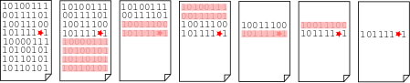
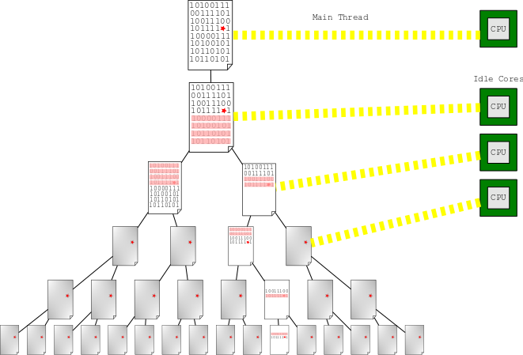
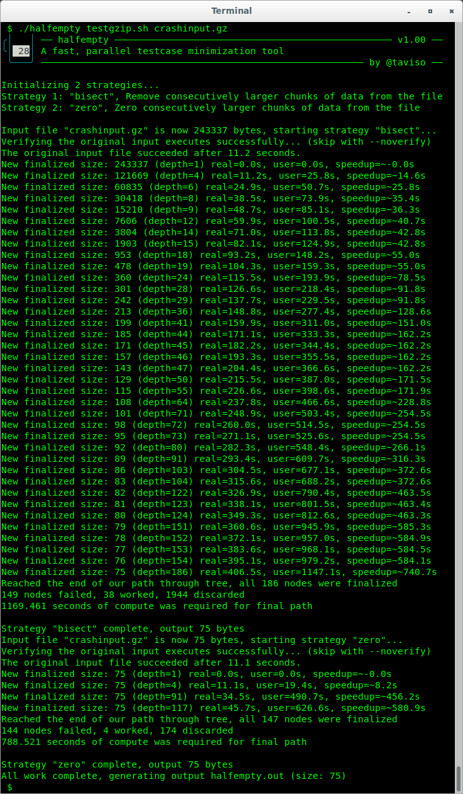
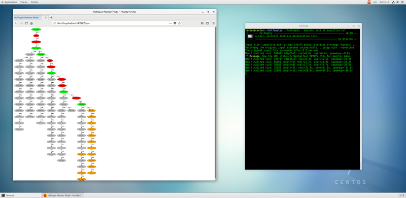

# Introducing halfempty 🥛
-------------------------------------------------------------------------------

## Fast, Parallel Testcase Minimization

Halfempty is a new testcase minimization tool, designed with parallelization in
mind. Halfempty was built to use strategies and techniques that dramatically
speed up the minimization process.

### Background

Fuzzers find inputs that trigger bugs, but understanding those bugs is easier
when you remove as much extraneous data as possible. This is called *testcase
minimization* or *delta debugging*.

Minimization tools use various techniques to simplify the testcase, but the
core algorithm is simply bisection. Bisection is an inherently serial process,
you can't advance through the algorithm without knowing the result of each
step. This data dependency problem can make minimization very slow, sometimes
taking hours to complete while cpu cores sit idle.

> 
>
> **In this diagram you can see we progressively remove parts of the file to determine which section is interesting.**

halfempty solves this problem using *pessimistic speculative execution*. We
build a binary tree of all the possible bisection steps and then idle cores can
speculatively test future steps ahead of our position in the algorithm. In many
cases, the test results are already known by the time we need them.

We call it *pessimistic*, because real workloads are characterized by long
series of consecutive failures. We simply assume that tests are going to fail,
and speculatively follow the failure path until proven wrong.

> 
>
> **In this diagram, you can see we generated a binary tree of all possible outcomes, and now idle cores can speculatively work ahead of the main thread.**

If you're fuzzing a target that takes more than a few seconds to run then
parallelizing the minimization can dramatically speedup your workflow. Real
fuzzing inputs that take several seconds to reproduce can take many hours to
complete using serial bisection, but halfempty can produce the same output in
minutes.

In real tests, the author often finds speedup exceeding hours.

>  
>
> **This is a real minimization path from a fuzzer generated crash.**
>
> Halfempty generates a binary tree, and this graph shows the path through the
> tree from the root to the final leaf (discarded paths are hidden on the left
> to simplify the diagram).
>
> The green nodes were successful and the red nodes were failures. The grey
> nodes in the right were explored but discarded. Because all consecutive red
> nodes are executed in parallel, the actual wall clock time required to
> minimize the input was minimal.
>
> Each crash took ~11 seconds to reproduce, requiring about  34 minutes of
> compute time - but halfempty completed in just **6 minutes**!
>
> The original input was 240K, the final output was just 75 bytes.

### Building

The only dependency is `libglib2.0-dev`, used for some useful data structures, like [N-ary trees](https://developer.gnome.org/glib/stable/glib-N-ary-Trees.html).

On RedHat systems, try `glib2-devel`.

Just type `make` to build the main binary.

The `--monitor` mode feature requires the `graphviz` package and a web browser.

The author has tested the following distributions:

* CentOS 6 amd64
* Ubuntu 14 amd64

#### Mac OS X

Halfempty has preliminary macOS support using [homebrew](https://brew.sh/).

Please use `brew install pkg-config glib` to install necessary dependencies, then `make` to build
the main binary.

### Usage

First, create a shell script that when given your input on stdin, returns zero.

A simple example might look like this if you wanted to test a `gzip` crash:

```bash
#!/bin/sh

gzip -dc

# Check if we were killed with SIGSEGV
if test $? -eq 139; then
    exit 0 # We want this input
else
    exit 1 # We don't want this input
fi
```

Make the file executable and verify it works:

```
$ chmod +x testgzip.sh
$ ./testgzip.sh < crashinput.gz && echo success || echo failure
success
```

Now simply run halfempty with your input and it will find the smallest version that still returns zero.

> **Note:** If you need to create temporary files, see some advanced examples in the documentation.


```
$ halfempty testgzip.sh crashinput.gz
```

If everything worked, there should be a minimal output file in `halfempty.out`.



If you want to monitor what halfempty is doing, you can use `--monitor` mode,
which will generate graphs you can watch in realtime. halfempty will generate a
URL you can open, and you can view the data in your web browser.

> **Note:** `--monitor` mode requires the graphviz package to be installed.

[](doc/images/monitor.png)


### Options

Halfempty includes many options to fine tune the execution environment for the
child processes, and tweak performance options. The full documentation can be
shown with `--help-all`, but here are the most commonly useful parameters.

| Parameter                                  | Description                                     |
|:-------------------------------------------|:------------------------------------------------|
| `--num-threads=threads`                    | Halfempty will default to using all available cores, but you can tweak this if you prefer. |
| `--stable`                                 | Sometimes different strategies can shake out new potential for minimizing.<br>If you enable this, halfempty will repeat all strategies until the output doesn't change.<br>(Slower, but recommended). |
| `--timeout=seconds`                        | If tested programs can run too long, we can send them a SIGALRM.<br>You can catch this in your test script (see `help trap`) and cleanup if you like, or accept the default action and terminate. |
| `--limit RLIMIT_???=N`                     | You can fine tune the resource limits available to child processes.<br>Perhaps you want to limit how much memory they can allocate, or enable core dumps.<br>An example might be `--limit RLIMIT_CPU=600` |
| `--inherit-stdout`<br>`--inherit-stderr`   | By default, we discard all output from children.<br>If you want to see the output instead, you can disable this and you can see child error messages. |
| `--zero-char=byte`                         | Halfempty tries to simplify files by overwriting data with nul bytes. This makes sense for binary file formats.<br> If you're minimizing text formats (`html`, `xml`, `c`, etc) then you might want whitespace instead.<br>Set this to `0x20` for space, or `0x0a` for a newline. |
| `--monitor`                                | If you have the `graphviz` package installed, halfempty can generate graphs so you watch the progress. |
| `--no-terminate`                           | If halfempty guesses wrong, it might already be running your test on an input we know we don't need.<br>By default, we will try to kill it so we can get back to using that thread sooner.<br>You can disable this if you prefer. |
| `--output=filename`                        | By default your output is saved to `halfempty.out`, but you can save it anywhere you like. |
| `--noverify`                               | If tests are very slow, you can skip the initial verification and go straight to parallelization.<br>(Faster, but not recommended). |
| `--generate-dot`                           | Halfempty can generate a dot file of the final tree state that you can inspect with xdot. |
| `--gen-intermediate`                       | Save the best result as it's found, so you don't lose your progress if halfempty is interrupted. |

### Examples

There are more examples available in the wiki.

#### Creating temporary files

> Note: Are you sure you need temporary files? Many programs will accept `/dev/stdin`.

If you need to create temporary files to give to your target program, you can simply do something like this.

```bash
#!/bin/sh
tempfile=`mktemp` && cat > ${tempfile}

yourprogram ${tempfile}
```

Remember to clean it up when you're done, you can do this if you like:

```bash
#!/bin/sh
tempfile=`mktemp` && cat > ${tempfile}
result=1

trap 'rm -f ${tempfile}; exit ${result}' EXIT TERM ALRM

yourprogram ${tempfile}

if test $? -eq 139; then
    result=0
fi
```

#### Verifying crashes

Sometimes your target program might crash with a different crash accidentally
found during minimization. One solution might be to use gdb to verify the crash
site.

```bash
#!/bin/sh
exec gdb -q                                                                 \
         -ex 'r'                                                            \
         -ex 'q !($_siginfo.si_signo == 11 && $pc == 0x00007ffff763f2e7)'   \
         -ex 'q 1'                                                          \
         --args yourprogram --yourparams
```

This will exit 0 if the signal number and crash address match, or 1 otherwise.

You can test various things such as registers (`$rip`, `$eax`, etc), fault
address (`$_siginfo._sifields._sigfault.si_addr`), and many more. If you want
to see more things you can test, try the command `show conv` in gdb.

### FAQ

**Q**. **What does finalized mean in halfempty output?**

**A**. Halfempty works by guessing what the results of tests will be before the
real result is known. If the path through the bisection tree from the root node
to the final leaf was entirely through nodes where we knew the result, then the
path is *finalized* (as opposed to *pending*).

**Q**. **Where does the name come from?**

**A**. We use *pessimistic* speculative execution, so the glass is always half
empty? ....? Sorry. 🥛

**Q**. **How can I kill processes that take too long?**

**A**. Use `--timeout 10` to send a signal that can be caught after 10 seconds,
or `--limit RLIMIT_CPU=10` to enforce a hard limit.

**Q**. **Halfempty wastes a lot of CPU time exploring paths, so is it really faster?**

**A**. It's significantly faster in real time (i.e. wall clock time), that's what counts!

**Q**. **I have a very large input, what do I need to know?**

**A**. Halfempty is less thorough by default on very large inputs that don't
seem to minimize well. Removing each byte from multi-gigabyte inputs just takes
too long, even when run in parallel.

If you really *want* halfempty to be thorough, you can do this:

`$ halfempty --bisect-skip-multiplier=0 --zero-skip-multiplier=0 --stable --gen-intermediate harness.sh input.bin`

* `--bisect-skip-multiplier=0` and `--zero-skip-multiplier=0` means to try removing every single byte.
* `--stable` means to keep retrying minimization until it no further removals work.
* `--gen-intermediate` means to save the best result as it's found, so you
won't lose your work if you change your mind.

On the other hand, if you just want halfempty to be faster and don't care if
it's not very thorough, you can do the opposite. Something like this:

`$ halfempty --bisect-skip-multiplier=0.01 --zero-skip-multiplier=0.01 harness.sh input.bin`

The reasonable range for the multiplier is `0` to `0.1`.

### BUGS

* If your program intercepts signals or creates process groups, it might be difficult to cleanup.
* For very long trees, we keep an fd open for each successful node. It's possible we might exhaust fds.

Please report more bugs or unexpected results to <taviso@google.com>. The
author intends to maintain this tool and make it a stable and reliable
component of your fuzzing workflow.

Better quality bug reports require simpler reproducers, and that requires good
quality tools.

### FUTURE

* The next version will allow the level of pessimism to be controlled at runtime.

### AUTHORS

Tavis Ormandy <taviso@google.com>

### LICENSE

Apache 2.0, See LICENSE file for details.

### NOTICE

This is not an officially supported Google product.

